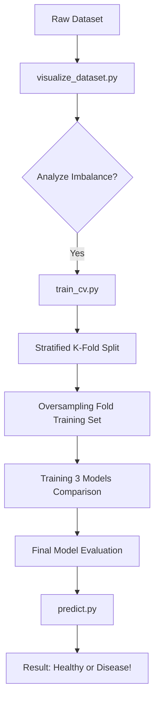

# 🗺️ Execution Flow: From Raw Data to Prediction

This is the order of how things happen when you run the project.

## Step 1: Data Preparation
We start with the `raw_dataset/`. Before training, we run `visualize_dataset.py` to prove that the data is imbalanced.

## Step 2: Training & Cross-Validation
We run `train_cv.py`.

### 🍞 The "Loaf of Bread" Analogy (The Rotation)
Think of the `raw_dataset` as a loaf of bread sliced into **5 equal pieces** (Folds).
1.  **The Split**: We take 4 pieces to **TRAIN** and 1 piece to **VALIDATE**.
2.  **The Rotation**: We repeat this 5 times, but each time a *different* piece is the one used for validation.
3.  **Scientific Result**: By the end, every single slice of bread has been tested once. This gives us a 100% fair and average accuracy score.

### ⚖️ The Timing of Balancing (Oversampling)
- **Wait!** We only oversample the **4 Training pieces** in each fold. 
- **The Validation piece** is kept exactly as it is (imbalanced).
- **Why?**: Because we want the model to train on balanced data, but we want to test it on "Real World" imbalanced data. This is the gold standard for handling class imbalance!

## Step 3: Comparison
We run `compare_architectures.py` to satisfy the course requirement. It tests **MobileNetV2**, **ResNet50V2**, and **DenseNet121** on the same data to see which one is the "smartest."

## Step 4: Final Evaluation
We run `evaluate.py`. It takes the saved models and generates the **Confusion Matrix**, showing us exactly which diseases the model might be confusing with others.

## Step 5: Real-World Test
We use `predict.py` to input a single new image and get a final diagnosis.
