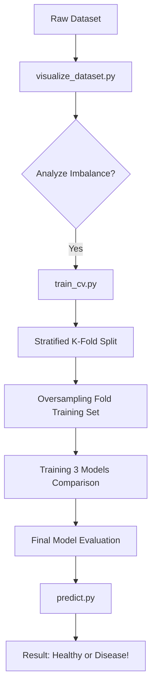

# 🗺️ Execution Flow: From Raw Data to Prediction

This is the order of how things happen when you run the project.

## Step 1: Data Preparation
We start with the `raw_dataset/`. Before training, we run `visualize_dataset.py` to prove that the data is imbalanced.

## Step 2: Training & Cross-Validation
We run `train_cv.py`.
1.  **Splitting**: The data is split into 5 chunks (folds).
2.  **Balancing**: The images are oversampled to make them equal.
3.  **Training**: The model is trained on 4 chunks and tested on the 5th. This repeats 5 times.
4.  **Saving**: The best-performing model from each fold is saved in `cv_models/`.

## Step 3: Comparison
We run `compare_architectures.py` to satisfy the course requirement. It tests **MobileNetV2**, **ResNet50V2**, and **DenseNet121** on the same data to see which one is the "smartest."

## Step 4: Final Evaluation
We run `evaluate.py`. It takes the saved models and generates the **Confusion Matrix**, showing us exactly which diseases the model might be confusing with others.

## Step 5: Real-World Test
We use `predict.py` to input a single new image and get a final diagnosis.
